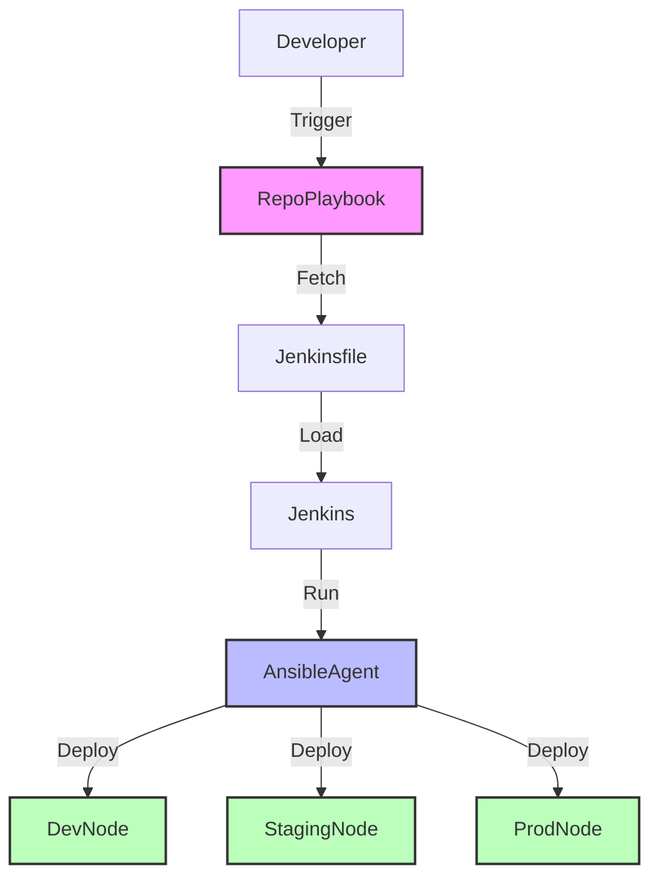

# Desafio7

Este repositorio contiene el código y las configuraciones necesarias para el proyecto Desafio7. Utiliza Ansible para la automatización de tareas y Jenkins para la integración continua y el despliegue continuo (CI/CD).

## Contenido

- [Requisitos](#requisitos)
- [Instalación](#instalación)
- [Estructura del Proyecto](#estructura-del-proyecto)
- [Uso](#uso)
- [Contribuciones](#contribuciones)
- [Licencia](#licencia)

## Requisitos

Antes de comenzar, asegúrate de tener los siguientes requisitos:

- [Ansible](https://docs.ansible.com/ansible/latest/installation_guide/intro_installation.html)
- [Jenkins](https://www.jenkins.io/download/)
- [Git](https://git-scm.com/downloads)

## Instalación

1. Clona el repositorio:

    ```bash
    git clone https://github.com/FrancoFazzito/Desafio7.git
    cd Desafio7
    ```

2. Configura Ansible:

    - Asegúrate de tener Ansible instalado.
    - Configura tu inventario en `ansible/inventory`.

3. Configura Jenkins:

    - Asegúrate de tener Jenkins instalado y funcionando.
    - Configura tu `Jenkinsfile` en Jenkins para que se ejecute en cada commit.

## Estructura del Proyecto

```plaintext
Desafio7/
├── ansible/
│   ├── inventory/
│   │   └── hosts            # Inventario de hosts
│   └── playbooks/
│       └── main.yml         # Playbook principal
├── Jenkinsfile              # Pipeline de Jenkins
└── README.md                # Documentación del proyecto
```

## Diagrama de alto nivel


